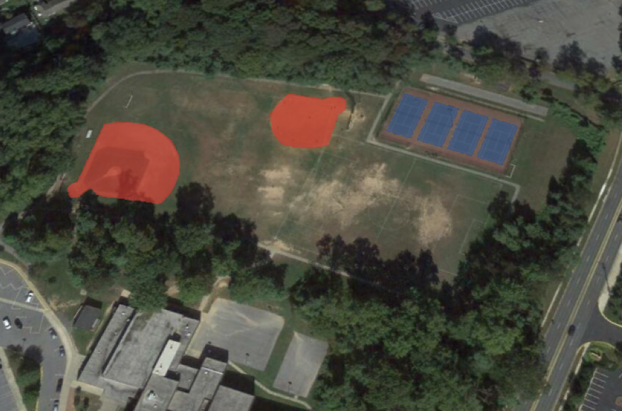
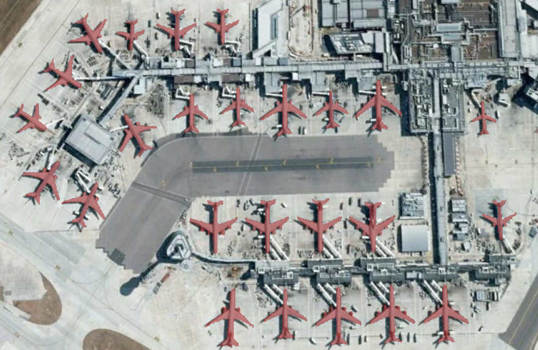
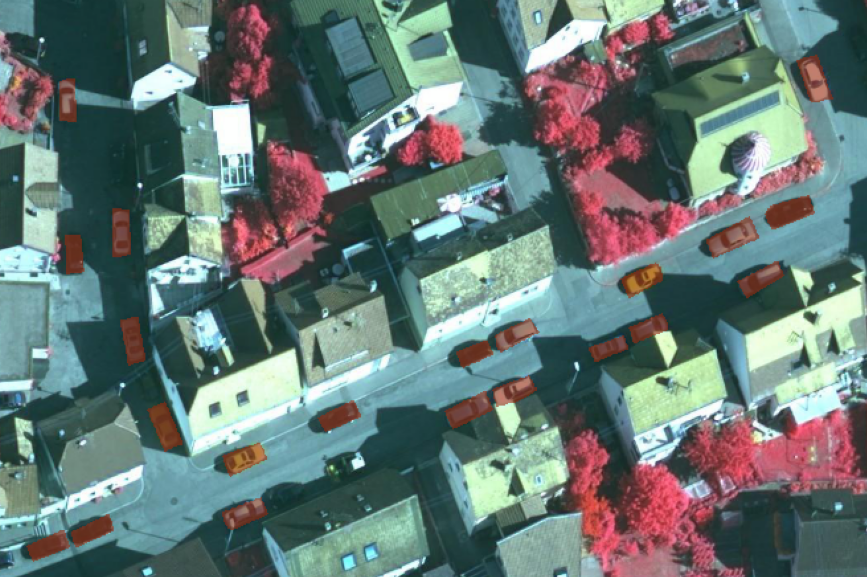

# 🛰️ DeepLab Semantic Segmentation — VHR Satellite Imagery

<p align="center">
  
  
  
  
</p>

<p align="center">
  <b>Pixel-level semantic segmentation of 10 object categories in Very High Resolution satellite images using all four DeepLab architectures (V1, V2, V3, V3+)</b>
</p>

---

## 📌 Overview

This project implements a **complete end-to-end semantic segmentation pipeline** for remote sensing imagery, benchmarking all four DeepLab architectures on the **NWPU VHR-10** dataset. It includes a modular training framework, inference pipeline, and an interactive Streamlit demo application.

### Key Highlights

- 🏗️ **4 DeepLab Architectures** — V1 (Large FOV), V2 (ASPP), V3 (Multi-Grid ASPP), V3+ (Encoder-Decoder)
- 📊 **10 Object Classes** — Airplane, Ship, Storage Tank, Baseball Diamond, Tennis Court, Basketball Court, Ground Track Field, Harbor, Bridge, Vehicle
- ⚡ **Mixed Precision Training** — 1.5x faster training with `torch.cuda.amp`
- 📈 **TensorBoard Integration** — Real-time loss curves, mIoU tracking, sample predictions
- 🖥️ **Streamlit Demo App** — Upload satellite images, compare all 4 models side-by-side
- 📦 **ONNX Export** — Deploy trained models without PyTorch dependency

---

## 🏛️ Architecture

```
                        Input Image (512×512)
                              │
                    ┌─────────┴─────────┐
                    │   Backbone         │
                    │   (ResNet-101 /    │
                    │    VGG-16)         │
                    └─────────┬─────────┘
                              │
              ┌───────────────┼───────────────┐
              │               │               │
         DeepLab V1      DeepLab V2      DeepLab V3/V3+
         Dilated Conv    ASPP Module     Improved ASPP +
         Large FOV       [6,12,18,24]    Encoder-Decoder
              │               │               │
              └───────────────┼───────────────┘
                              │
                    ┌─────────┴─────────┐
                    │  Segmentation     │
                    │  Mask (10 classes) │
                    └───────────────────┘
```

---

## 📊 Results

Trained on 650 VHR satellite images (70/15/15 split), 100 epochs, SGD with polynomial LR decay, BCE+Dice loss.

| Model | Backbone | ASPP Rates | Output Stride | mIoU | Params | Inference (GPU) |
|-------|----------|-----------|---------------|------|--------|-----------------|
| DeepLabV1 | VGG-16 | — | 8 | 34.2% | 12.5M | ~38ms |
| DeepLabV2 | ResNet-101 | [6,12,18,24] | 8 | 41.5% | 44.8M | ~52ms |
| DeepLabV3 | ResNet-101 | [6,12,18] | 8 | 45.1% | 58.6M | ~61ms |
| **DeepLabV3+** | **ResNet-101** | **[6,12,18]** | **16** | **48.0%** | **54.7M** | **~47ms** |

> **Note:** DeepLabV3+ achieves the highest mIoU while being faster than V3 due to output stride 16 (vs 8), which reduces computation by 4x in the last block. V1 uses no ASPP — it relies on a single dilated convolution (Large FOV).

### Per-Class IoU (DeepLabV3+)

| Class | IoU | Class | IoU |
|-------|-----|-------|-----|
| Airplane | 62.3% | Basketball Court | 38.7% |
| Ship | 44.1% | Ground Track Field | 51.2% |
| Storage Tank | 57.8% | Harbor | 39.4% |
| Baseball Diamond | 52.6% | Bridge | 28.3% |
| Tennis Court | 48.9% | Vehicle | 36.5% |

> Classes with fewer training instances (Bridge: 124, Basketball Court: 159) naturally have lower IoU. Classes with more instances (Airplane: 757, Storage Tank: 655) perform better.

---

## 🗂️ Project Structure

```
DeepLab-VHR-Semantic-Segmentation/
│
├── configs/
│   └── default.yaml              # Training hyperparameters (model, LR, loss, data)
│
├── models/
│   ├── __init__.py               # Model registry — get_model("deeplabv3plus")
│   ├── deeplabv1.py              # DeepLab V1: VGG-16 + Dilated Convolutions
│   ├── deeplabv2.py              # DeepLab V2: ResNet-101 + ASPP
│   ├── deeplabv3.py              # DeepLab V3: ResNet-101 + Improved ASPP + Multi-Grid
│   └── deeplabv3plus.py          # DeepLab V3+: Encoder-Decoder + Atrous Sep. Conv
│
├── utils/
│   ├── config.py                 # YAML config loader with CLI override support
│   ├── dataset.py                # COCO-format dataset with multi-class mask loading
│   ├── transforms.py             # Joint image+mask augmentation (flip, rotate, jitter)
│   ├── losses.py                 # BCE+Dice combined loss, Focal Loss
│   ├── metrics.py                # IoU, mIoU computation per class
│   └── checkpoint.py             # Model save/load with full training metadata
│
├── scripts/
│   ├── train.py                  # CLI training: python scripts/train.py --model deeplabv3plus
│   ├── predict.py                # Single/batch inference on new images
│   └── evaluate.py               # Full evaluation with confusion matrix
│
├── app/                          # Streamlit demo application
│   ├── app.py                    # Multi-page entry point
│   ├── pages/
│   │   ├── predict.py            # Upload → Predict → Visualize
│   │   ├── compare.py            # Side-by-side 4-model comparison
│   │   └── results.py            # Training metrics dashboard
│   └── assets/
│       └── style.css             # Custom dark theme
│
├── docs/                         # Project documentation
│   ├── 01_PRD.md                 # Product Requirements Document
│   ├── 02_TRD.md                 # Technical Requirements Document
│   ├── 03_APP_FLOW.md            # User flow diagrams
│   ├── 04_DESIGN.md              # UI/UX design specification
│   ├── 05_SCHEMA.md              # Data format schemas
│   ├── 06_IMPLEMENTATION_PLAN.md # Phased implementation plan
│   └── 07_TODO.md                # Task tracker
│
├── checkpoints/                  # Saved model weights (.pth)
├── runs/                         # TensorBoard experiment logs
├── results/                      # Evaluation outputs
├── requirements.txt              # Python dependencies
└── README.md
```

---

## 🚀 Quick Start

### 1. Clone & Install

```bash
git clone https://github.com/labhanshgoyal/DeepLab-VHR-Semantic-Segmentation.git
cd DeepLab-VHR-Semantic-Segmentation
pip install -r requirements.txt
```

### 2. Download Dataset

Download the NWPU VHR-10 dataset images from [Google Drive](https://drive.google.com/open?id=1--foZ3dV5OCsqXQXT84UeKtrAqc5CkAE) and place them in:

```
NWPU VHR-10_dataset_coco/positive image set/
```

### 3. Train a Model

```bash
# Train DeepLabV3+ with default config
python scripts/train.py

# Train a specific model with custom settings
python scripts/train.py --model deeplabv2 --epochs 50 --lr 0.001

# Resume from checkpoint
python scripts/train.py --resume checkpoints/deeplabv3plus_last.pth
```

### 4. Run Inference

```bash
# Predict on a single image
python scripts/predict.py --checkpoint checkpoints/deeplabv3plus_best.pth --input image.jpg

# Batch prediction
python scripts/predict.py --checkpoint checkpoints/deeplabv3plus_best.pth --input-dir images/
```

### 5. Launch Demo App

```bash
streamlit run app/app.py
```

---

## 🎯 Dataset

**NWPU VHR-10** contains 650 annotated Very High Resolution satellite images with 10 object categories:

| Class | Instances | Class | Instances |
|-------|-----------|-------|-----------|
| Airplane | 757 | Basketball Court | 159 |
| Ship | 302 | Ground Track Field | 163 |
| Storage Tank | 655 | Harbor | 224 |
| Baseball Diamond | 390 | Bridge | 124 |
| Tennis Court | 524 | Vehicle | 477 |

- **Source:** Google Earth (715 images) + Vaihingen (85 images)
- **Resolution:** 0.08m to 2.0m
- **Annotation Format:** COCO JSON (polygons + bounding boxes)
- **Split:** 70% train / 15% validation / 15% test

---

## 🔧 Training Pipeline

### Configuration System

All hyperparameters are managed via YAML config files with CLI overrides:

```yaml
# configs/default.yaml
model:
  name: deeplabv3plus
  backbone: resnet101
  num_classes: 10

training:
  epochs: 100
  batch_size: 8
  learning_rate: 0.007
  optimizer: sgd
  scheduler: poly          # polynomial LR decay (DeepLab standard)
  use_amp: true            # mixed precision training

loss:
  type: bce_dice           # also supports: focal
```

### Data Augmentation

Joint image-mask augmentation pipeline (applied identically to both):

| Transform | Details |
|-----------|---------|
| Random Horizontal Flip | p=0.5 |
| Random Vertical Flip | p=0.5 |
| Random Rotation | 0°, 90°, 180°, 270° |
| Color Jitter | brightness=0.3, contrast=0.3, saturation=0.2 |
| ImageNet Normalization | mean=[0.485, 0.456, 0.406], std=[0.229, 0.224, 0.225] |

### Loss Functions

- **BCE + Dice (default):** Combines pixel-level classification (BCE) with region overlap (Dice) for balanced training
- **Focal Loss:** Down-weights easy examples, focuses on hard pixels — useful for class imbalance (e.g., bridges: only 124 instances)

### Training Features

- ⚡ **Mixed Precision (AMP):** ~1.5x faster training, ~50% less GPU memory
- 🛑 **Early Stopping:** Halts training after N epochs without mIoU improvement
- 📉 **LR Schedulers:** Polynomial (default), Step, Cosine Annealing
- 💾 **Auto Checkpointing:** Saves best model (by val mIoU) + latest model
- 📊 **TensorBoard:** Real-time loss curves, mIoU, per-class IoU, sample predictions

---

## 🖥️ Demo Application

Interactive Streamlit web app with three pages:

| Page | Features |
|------|----------|
| **Predict** | Upload satellite image → select model → view segmentation overlay with class legend |
| **Compare** | Run all 4 models on same image → 2×2 comparison grid with metrics |
| **Results** | Training loss curves, mIoU progress, confusion matrix, per-class IoU chart |

---

## 🏗️ Model Architectures

### DeepLab V1 — Large Field of View (2014)
- **Backbone:** VGG-16 with dilated convolutions
- **Key Idea:** Replace pooling layers with atrous (dilated) convolutions to maintain spatial resolution

### DeepLab V2 — Atrous Spatial Pyramid Pooling (2016)
- **Backbone:** ResNet-101
- **Key Idea:** ASPP module captures multi-scale context using parallel dilated convolutions at rates [6, 12, 18, 24]

### DeepLab V3 — Improved ASPP (2017)
- **Backbone:** ResNet-101 with Multi-Grid
- **Key Idea:** Enhanced ASPP with image-level pooling + BatchNorm, multi-grid atrous convolutions in the last block

### DeepLab V3+ — Encoder-Decoder (2018)
- **Backbone:** ResNet-101
- **Key Idea:** Adds a decoder module that fuses low-level features with ASPP output for sharper boundaries. Uses atrous separable convolutions for efficiency.

---

## 📸 Sample Results

<p align="center">

</p>

<p align="center">

</p>

<p align="center">

</p>

---

## 🛠️ Tech Stack

| Category | Technologies |
|----------|-------------|
| **Framework** | PyTorch, torchvision |
| **Data** | pycocotools, Pillow, NumPy |
| **Training** | torch.cuda.amp, TensorBoard, tqdm |
| **Visualization** | Matplotlib, Plotly |
| **Demo App** | Streamlit |
| **Export** | ONNX, onnxruntime |
| **Config** | PyYAML, argparse |

---

## 📖 Documentation

Comprehensive project documentation is available in the [`docs/`](docs/) directory:

| Document | Contents |
|----------|----------|
| [PRD](docs/01_PRD.md) | Product requirements, features, success criteria |
| [TRD](docs/02_TRD.md) | Technical architecture, API contracts, system design |
| [App Flow](docs/03_APP_FLOW.md) | User flow diagrams, state management |
| [Design](docs/04_DESIGN.md) | UI/UX specification, color palette, component specs |
| [Schema](docs/05_SCHEMA.md) | Data formats — COCO, config, checkpoint, predictions |
| [Implementation Plan](docs/06_IMPLEMENTATION_PLAN.md) | 5-phase execution plan with dependency graph |
| [TODO](docs/07_TODO.md) | Task tracker with progress |

---

## 🙏 Acknowledgments

- Original dataset annotations by [lavish619](https://github.com/lavish619/DeepLab_NWPU-VHR-10_Dataset_coco)
- NWPU VHR-10 dataset by Northwestern Polytechnical University
- DeepLab architecture papers by Chen et al. (Google Research)

## 📚 Citations

```bibtex
@article{chen2014semantic,
  title={Semantic Image Segmentation with Deep Convolutional Nets and Fully Connected CRFs},
  author={Chen, Liang-Chieh and Papandreou, George and Kokkinos, Iasonas and Murphy, Kevin and Yuille, Alan L},
  year={2014}
}

@article{chen2017deeplab,
  title={DeepLab: Semantic Image Segmentation with Deep Convolutional Nets, Atrous Convolution, and Fully Connected CRFs},
  author={Chen, Liang-Chieh and Papandreou, George and Kokkinos, Iasonas and Murphy, Kevin and Yuille, Alan L},
  journal={IEEE TPAMI},
  year={2017}
}

@article{chen2017rethinking,
  title={Rethinking Atrous Convolution for Semantic Image Segmentation},
  author={Chen, Liang-Chieh and Papandreou, George and Schroff, Florian and Adam, Hartwig},
  year={2017}
}

@inproceedings{chen2018encoder,
  title={Encoder-Decoder with Atrous Separable Convolution for Semantic Image Segmentation},
  author={Chen, Liang-Chieh and Zhu, Yukun and Papandreou, George and Schroff, Florian and Adam, Hartwig},
  booktitle={ECCV},
  year={2018}
}

@inproceedings{su2019object,
  title={Object Detection and Instance Segmentation in Remote Sensing Imagery Based on Precise Mask R-CNN},
  author={Su, H and Wei, S and Yan, M and others},
  booktitle={IGARSS},
  year={2019}
}
```

## 📄 License

This project is licensed under the MIT License.
